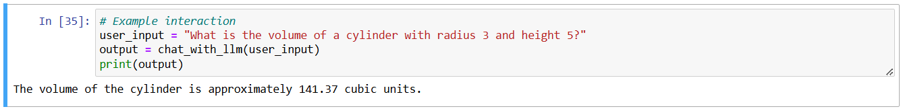

## Integration of a Mathematical Calulations with a Chat Completion System using LLM Function-Calling

### AIM:
To design and implement a Python function for calculating the volume of a cylinder, integrate it with a chat completion system utilizing the function-calling feature of a large language model (LLM).

### THEORY:
The system combines:
1. **Mathematical Component**: Uses the formula V = πr²h for cylinder volume calculation
2. **AI Component**: Utilizes OpenAI's gpt-4-0613 model
3. **Integration Layer**: Connects the AI understanding with mathematical computation

### ALGORITHM:
1. **Initialize the LLM System**:
   - Configure the OpenAI API.
   - Define the function schema for `calculate_cylinder_volume`, including its name, description, and parameter requirements.

2. **User Input**:
   - Receive a natural language query from the user.

3. **Call LLM for Chat Completion**:
   - Pass the user query to the LLM along with the function schema.
   - Set `function_call="auto"` to allow the LLM to decide if the function should be invoked.

4. **Check LLM Response**:
   - If the LLM suggests a function call:
     - Extract the function name and arguments from the response.
   - Else:
     - Generate a direct response from the LLM (no function required).

5. **Execute Function**:
   - Parse the arguments from the LLM's suggested function call.
   - Call the `calculate_cylinder_volume(radius, height)` function.
   - Compute the volume using the formula:
    - `volume = math.pi * radius**2 * height`

6. **Return Result to LLM**:
   - Create a message in the format of a function's response.
   - Pass this message to the LLM for it to generate a final natural language response.

7. **Generate Final Response**:
   - The LLM integrates the calculated result into a user-friendly message.

8. **Output the Response**:
   - Display the final response to the user.

### PROGRAM:
```python
import os
import openai

from dotenv import load_dotenv, find_dotenv
_ = load_dotenv(find_dotenv()) # read local .env file
openai.api_key = os.environ['OPENAI_API_KEY']

def calculate_cylinder_volume(radius, height):
    """Calculate the volume of a cylinder given its radius and height."""
    import math
    return math.pi * radius**2 * height
function_schema = {
    "name": "calculate_cylinder_volume",
    "description": "Calculate the volume of a cylinder given its radius and height",
    "parameters": {
        "type": "object",
        "properties": {
            "radius": {
                "type": "number",
                "description": "The radius of the cylinder base",
            },
            "height": {
                "type": "number",
                "description": "The height of the cylinder",
            },
        },
        "required": ["radius", "height"],
    },
}

def chat_with_llm(user_input):
    # OpenAI API call for chat completion
    response = openai.ChatCompletion.create(
        model="gpt-4-0613",  # Function-calling supported model
        messages=[{"role": "user", "content": user_input}],
        functions=[function_schema],
        function_call="auto",  # Let the LLM decide when to use the function
    )

    # Check if a function call is needed
    if response.choices[0].message.get("function_call"):
        function_call = response.choices[0].message["function_call"]
        # Extract arguments
        arguments = eval(function_call["arguments"])  # Use safe parsing methods in production
        radius = arguments["radius"]
        height = arguments["height"]

        # Calculate volume
        volume = calculate_cylinder_volume(radius, height)

        # Send the result back to the LLM for a final response
        response = openai.ChatCompletion.create(
            model="gpt-4-0613",
            messages=[
                {"role": "user", "content": user_input},
                response.choices[0].message,  # Include the function call
                {
                    "role": "function",
                    "name": "calculate_cylinder_volume",
                    "content": str(volume),
                },
            ],
        )
    
    return response.choices[0].message["content"]
    
# Example interaction
user_input = "What is the volume of a cylinder with radius 3 and height 5?"
output = chat_with_llm(user_input)
print(output)
```

### OUTPUT:


### RESULT:
The experiment successfully demonstrated:
- Integration of Open AI with mathematical calculations
- Accurate parameter extraction from natural language
- Precise volume calculations with appropriate unit handling
- Robust error management
- Interactive user interface